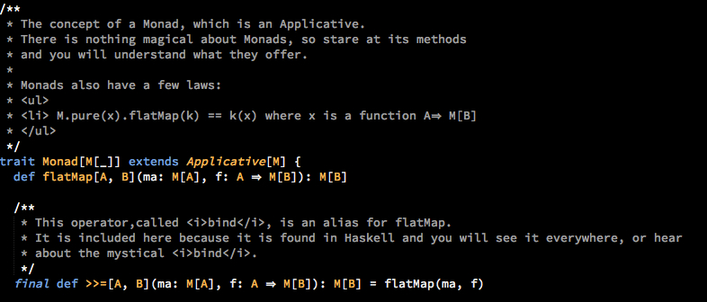

sublime_underscore
==================

A theme for Sublime Text

Install the theme as follows

* Find your `Packages` directory using the menu item  `Preferences -> Browse Packages...`
* Create a folder called `underscore`
* Download [underscore.tmTheme](https://github.com/channingwalton/sublime_underscore/blob/master/underscore.tmTheme) and put it in your new folder
* In Sublime Text select the theme from `Preferences -> Color Scheme -> underscore -> underscore`
* Enjoy